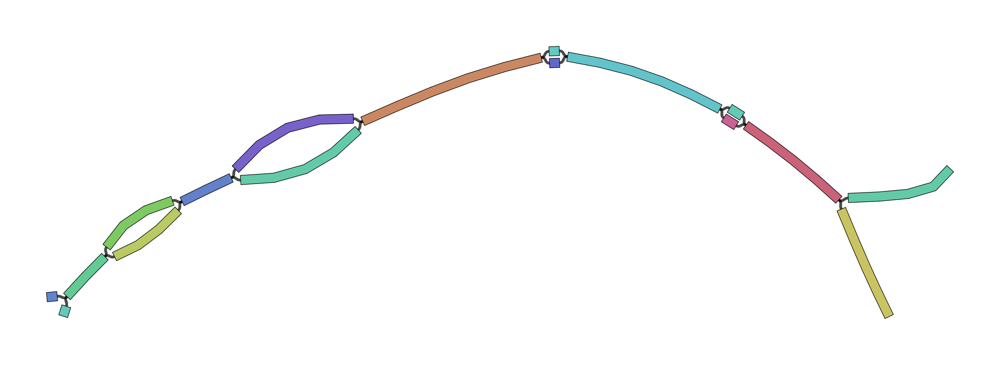
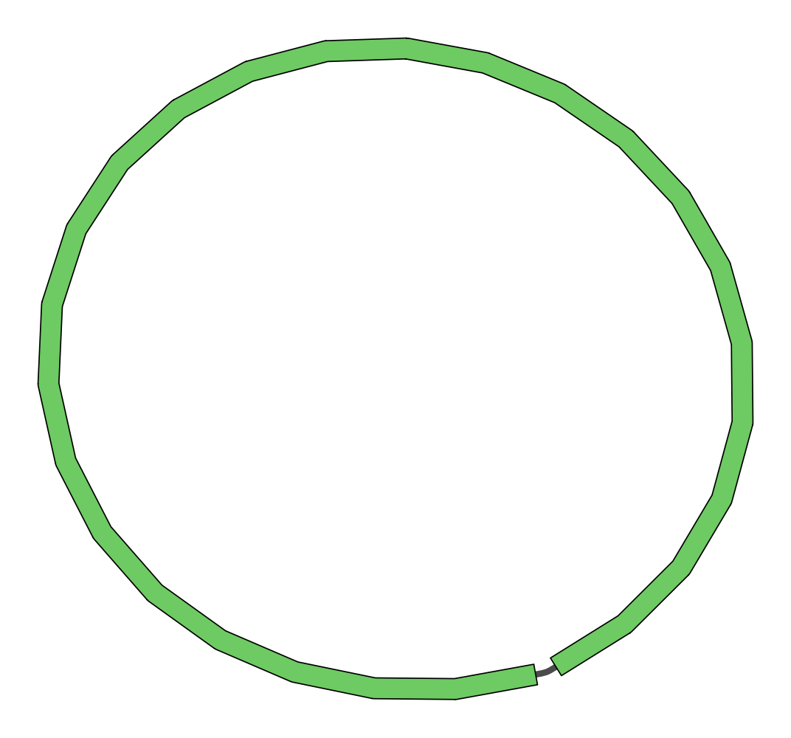

# Example of a MinYS run on a pea aphid sample

We will run MinYS on one of the samples described in the paper with the same settings.

Reference of the pre-print : 

 MinYS: Mine Your Symbiont by targeted genome assembly in symbiotic communities.
Cervin Guyomar, Wesley Delage, Fabrice Legeai, Christophe Mougel, Jean-Christophe Simon, Claire Lemaitre

[Link](https://doi.org/10.1101/2019.12.13.875021)

## Download data

We will donwload :
 - One metagenomic pea aphid sample from SRA using SRA tools
     This library is made of 84,627,212 Illumina paired end reads of length 100bp.
 - The reference genome of *Buchnera aphidicola* from *Myzus persicae* (medium divergence in the paper). The length of the reference genome is 643,517 bp.
 


```bash
# Donwload the metagenomic sample
fastq-dump --split-files  SAMN02934112

# Download the Buchnera aphidicola G002 reference genome
wget https://ftp.ncbi.nlm.nih.gov/genomes/all/GCF/000/521/565/GCF_000521565.1_ASM52156v1/GCF_000521565.1_ASM52156v1_genomic.fna.gz
gunzip GCF_000521565.1_ASM52156v1_genomic.fna.gz

```

## Run MinYS

### Basic run

The parameter values used here are the ones used in the paper.

**How to choose the parameter values ?**

The main parameters are the kmer size and minimum abundance threshold for the two assembly steps : backbone assembly (`-assembly-kmer-size` and `-assembly-abundance-min`) and gap-filling (`-gapfilling-kmer-size` and `-gapfilling-abundance-min`). Their optimal values depend on the targeted genome coverage in the metagenomic sample. 

In theory, the greater the kmer size, the more linear will be the de bruijn graph and the better will be the assembly (repeats smaller than $k$ will be resolved). But $k$ must not be two large in order to occur in a sufficient number of reads and to be distinguished from sequencing errors. The minimum abundance threshold is used to discard kmers that have few occurences in the dataset (below this threshold) and that are likely to contain sequencing errors.

For lowly covered genomes ($<$50x), the minimal value of $k$ is around 25-31 (we often use odd numbers), together with a minimal abundance threshold of 3.   

Here, the Buchnera genome is expected to be present at 770 X in the sequencing sample. Therefore, we increased the k value to 51 and 61, with minimum abundance thresholds of 5 and 10. We used more stringent parameters for the backbone assembly, to ensure good quality and specific contigs. For the gap-filling, less stringent parameters are used to be able to recover potential strain-specific gap-fillings (with a lower abundance in the sample than the conserved regions).  


```bash
# Install and load MinYS conda environment
conda create -c bioconda -p ~/conda/env_MinYS minys
conda activate ~/conda/env_MinYS

MinYS.py -1 SAMN02934112_1.fastq -2 SAMN02934112_2.fastq \  # input data
        -ref GCF_000521565.1_ASM52156v1_genomic.fna \       # reference genome
        -assembly-kmer-size 61 -assembly-abundance-min 10 -min-contig-size 400 \  # assembly settings
        -gapfilling-kmer-size 51 -gapfilling-abundance-min 5 -max-nodes 300 -max-length 50000 \ #gapfilling settings
        -nb-cores 8 \
        -out MinYS_example
# Expected runtime 40 minutes with 8 cores
```

### Inspecting the results

One directory is created for the run, containing one sub-directory per step (`mapping`, `assembly` and `gapfilling`) and one sub-directory `logs` containing information on the run.  


```bash
ls MinYS_example/

```

    assembly  gapfilling  logs  mapping


The **final output file** is located in the gapfilling subdirectory:
`MinYS_example/gapfilling/*.simplified.gfa`

#### Looking at the results of the assembly step

Here 433 contigs were assembled for a total of 374kb. (the target size is 642kb)


```bash
grep \> MinYS_example/assembly/minia_k61_abundancemin_10_filtered_400.fa | wc -l
grep -v ">" MinYS_example/assembly/minia_k61_abundancemin_10_filtered_400.fa | wc | awk '{print $3-$1}' 
```

    433
    374165


###### Looking at the gapfilling results
The output of MinYS is a genome graph in the GFA format, it can be visualized using [Bandage](https://github.com/rrwick/Bandage) for further analysis.
Bandage allows to : 
- Visualize the graph
- Blast nodes against known genomes
- Edit the graph by removing or merging some nodes

Two GFA graphs are available in the `gapfilling` directory : 
- `minia_k61_abundancemin_10_filtered_400_gapfilling_k51_abundancemin_5.gfa` is an intermediary file, it is the raw output of MindTheGap, where nodes are either contigs from the assembly step or gapfillings between two contigs.
- `minia_k61_abundancemin_10_filtered_400_gapfilling_k51_abundancemin_5.simplified.gfa` is final output of MinYS pipeline. It is the simplified version of the graph, where redundant sequences have been removed.

First, let's look at the raw graph, `minia_k61_abundancemin_10_filtered_400_gapfilling_k51_abundancemin_5.gfa`:
    
Contig nodes are named with a number. 
Gapfilling nodes are named with the following pattern : `114;476;len_2467_qual_50_median_cov_415` is a gapfilling between contigs `114` and `476` with a length of 2467 bp and median kmer abundance of 415.
    


```bash
# Show the raw graph using Bandage (only a subset for readability)
Bandage image MinYS_example/gapfilling/minia_k61_abundancemin_10_filtered_400_gapfilling_k51_abundancemin_5.gfa  img/graph.raw.png --scope aroundnodes --nodes 1 --distance 5
```



The image above represents a subset of the graph, showing the contig node of id 1 with its context at a maximal distance of 5 nodes.

Then, let's look at the final output genome graph in  `minia_k61_abundancemin_10_filtered_400_gapfilling_k51_abundancemin_5.simplified.gfa`:

Here, there is only one circular contig after simplification


```bash
Bandage image MinYS_example/gapfilling/minia_k61_abundancemin_10_filtered_400_gapfilling_k51_abundancemin_5.simplified.gfa  img/graph.simplified.png
```



## Utility scripts

Alternatively or in addition to the Bandage visualization, some scripts are available to process the graph : 
 - `gfa2fasta.py` can be used to write the nodes of the graph in a fasta file for further processing. All edges between nodes are lost. A minimal length threshold can be applied to filter out small nodes.
 Usage : 


```bash
gfa2fasta.py MinYS_example/gapfilling/minia_k61_abundancemin_10_filtered_400_gapfilling_k51_abundancemin_5.simplified.gfa assembly.fa 0
```

  - `filter_components.py` allows small connected components of the graph (whose total assembled size is smaller than a given threshold) to be removed (not relevant here since we have only one component)


```bash
filter_components.py MinYS_example/gapfilling/minia_k61_abundancemin_10_filtered_400_gapfilling_k51_abundancemin_5.simplified.gfa larger_components.gfa 100000
```

  - `enumerate_paths` will enumerate and compare all the paths in each connected component of the graph, and output those that show significant length or sequence differences. (not relevant here since we have only one node/path).
  The paths are written in the out directory supplied as parameter


```bash
enumerate_paths.py MinYS_example/gapfilling/minia_k61_abundancemin_10_filtered_400_gapfilling_k51_abundancemin_5.simplified.gfa outdir
```

The output directory will contain one sub-diretory for each component, containing one fasta file per enumerated path plus a dedicated file for the longest enumerated path.
```
outdir
├── comp_1
    ├── path1.fa
    ├── path2.fa
    ├── path3.fa
    └── largest.fa
├── comp_2
    ├── path1.fa
    └── largest.fa
└── comp_3
    ├── path1.fa
    ├── path2.fa
    └── largest.fa
```

